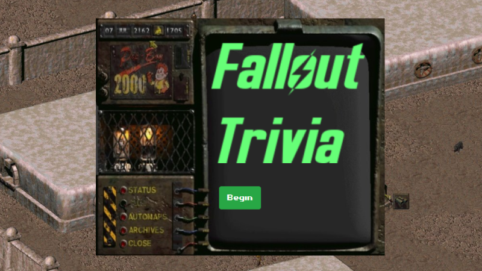

# TriviaGame

Deployed Site: [bryanbloomquist.com/trivia-game](https://bryanbloomquist.com/trivia-game)

## Overview

Trivia Game is a Fallout trivia game that uses timers, HTML, CSS, Javascript, and jQuery

## Requirements: Advanced Assignment (Timed Questions)

* Show only one question until the player answers it or their time runs out.

* If the player selects the correct answer, show a screen congratulating them for choosing the right option. After a few seconds, display the next question -- do this without user input.

* The scenario is similar for wrong answers and time-outs.

  * If the player runs out of time, tell the player that time's up and display the correct answer. Wait a few seconds, then show the next question.

  * If the player chooses the wrong answer, tell the player they selected the wrong option and then display the correct answer. Wait a few seconds, then show the next question.

* On the final screen, show the number of correct answers, incorrect answers, and an option to restart the game (without reloading the page).

## Additional Notes

* I used a screenshot from Fallout 1 as the background and the Pip-Boy image is also from Fallout 1.

* I found a font that is very similar to that used in the original Fallout PC games.

* If you get more than 50% correct you get the good ending, the same good ending as Fallout 1, you are forced into exile.  It looks like a bad ending, but....

* If you get more than 50% wrong you get the bad ending, the same bad game over screen from Fallout 1, your skeleton alone in the wasteland.

## Screenshot

